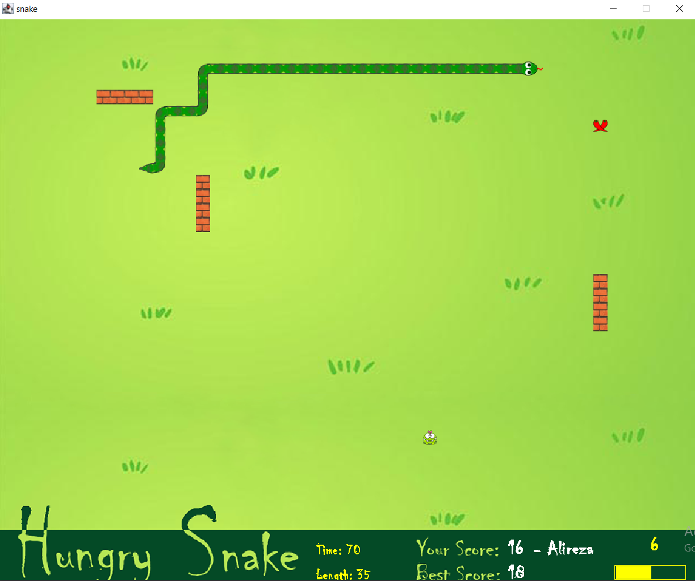
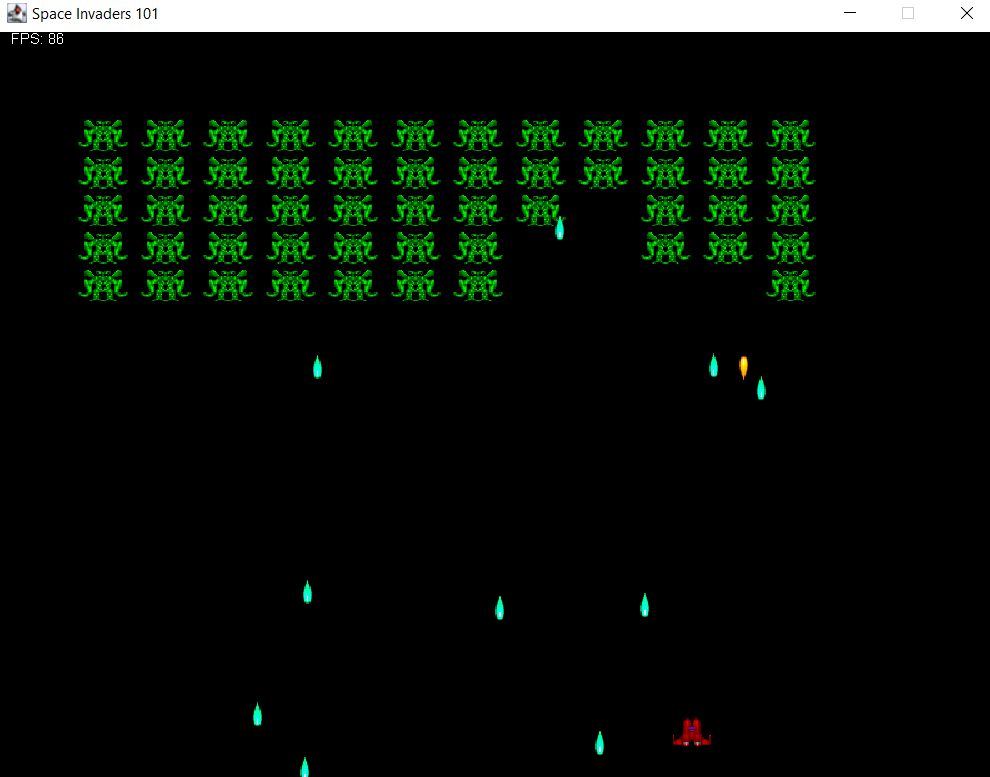

This is the code we implemented for the HCI project including two games called Snake and Space Invaders.

You can play both games either keyboard or gamepad. In order to use gamepad you should install [Jamepad](https://github.com/williamahartman/Jamepad) library. No requirement for keyboard.

P.N. Space Invaders is a game based on [this tutorial](http://www.cokeandcode.com/info/tut2d.html).

Demo
--------

